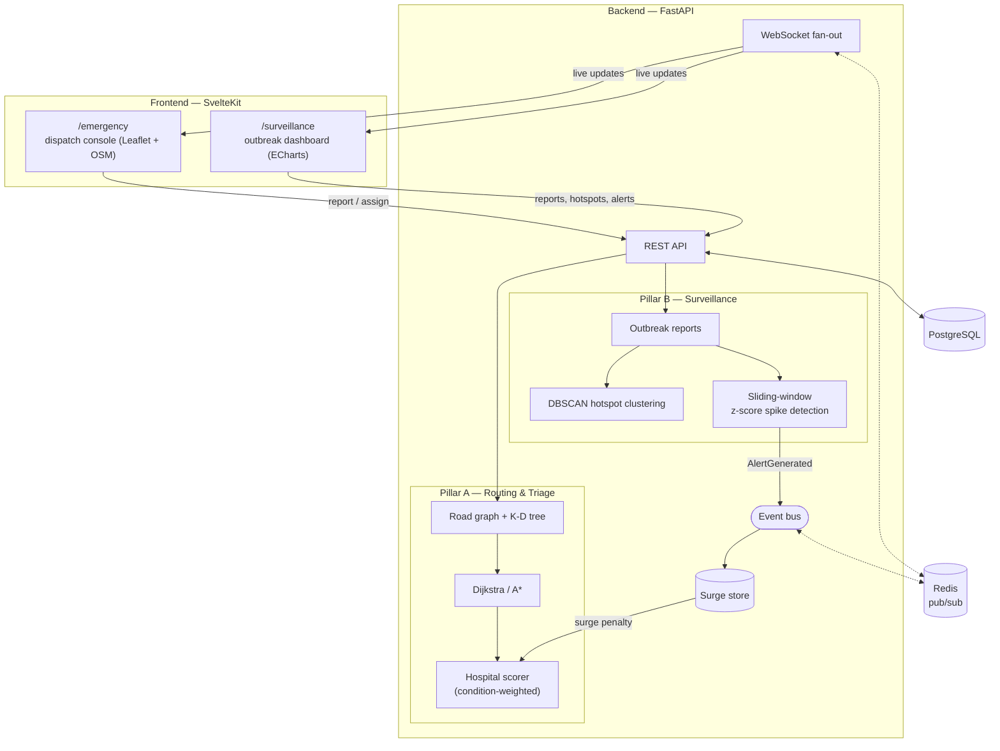

# EpiWatch

EpiWatch is an epidemic monitoring and emergency-response platform where outbreak
surveillance and ambulance dispatch are not two separate tools bolted together, but one
system: a spike in disease activity in a region automatically feeds into how the next
ambulance in that area gets routed.

**Live demo:** [epiwatch-tau.vercel.app](https://epiwatch-tau.vercel.app)
(`/surveillance` and `/emergency` — backend API on Railway)

## Overview

Most "smart city" demos treat surveillance dashboards and dispatch systems as unrelated
products — one shows charts, the other draws routes, and nobody connects them. EpiWatch
is built around the opposite premise: an outbreak is exactly the kind of event that
*should* change routing decisions. If a region is showing an abnormal spike in cholera
cases, the hospitals near that region are about to come under load, and an ambulance
deciding between "slightly closer, about to be overwhelmed" and "a few minutes further,
currently fine" should know that.

The platform has two pillars. **Pillar A (Emergency Response)** takes an emergency
location and patient condition, finds the optimal route to candidate hospitals over a
road-network graph, and scores each hospital on a condition-specific weighted model —
travel time, bed and ICU availability, current load, specialization match — to pick the
best one and explain *why*. **Pillar B (Outbreak Surveillance)** ingests historical and
recent disease-report data, clusters it into geographic hotspots, and runs a sliding-window
anomaly detector that raises severity-tiered alerts when a region's case counts spike.

The two pillars never call each other's code directly. They're connected by an
in-process event bus: when Pillar B's spike detector raises an alert, it publishes an
`AlertGenerated` event; Pillar A's hospital scorer subscribes to that event and applies a
temporary "surge penalty" to hospitals near the affected region. The result is
surveillance-aware routing — ambulances get steered away from hospitals that are about to
be hit by a surge, *ahead* of that surge actually landing on them, without the two pillars
knowing anything about each other beyond the shared event vocabulary.

## Architecture



The dotted edges are the real-time backbone: every state change that matters (a new
emergency, a hospital capacity update, a recomputed hotspot, a generated alert) is
published as an event on a Redis-backed pub/sub bus, and a thin WebSocket layer fans those
events out to every connected browser. The solid `Spike → AlertGenerated → Surge store →
Scorer` path at the bottom is the one piece of cross-pillar wiring in the whole system —
everything else in Pillar A and Pillar B is independently testable and has zero imports
from the other side (enforced by an AST-based test, see below).

## Key engineering

A few pieces of this were worth building from scratch rather than reaching for a library,
because the point was to actually understand and be able to defend the algorithm, not just
call it.

- **Hand-built K-D tree** (`backend/app/graph/kdtree.py`) for nearest-node lookup —
  finding the road-graph node closest to an emergency's lat/lon, and reused as the spatial
  index for hotspot clustering. A flat linear scan over ~2,500 nodes would work fine at
  this scale, but the K-D tree is what makes the *same* nearest-neighbour code scale to a
  real city-sized graph, and it's the kind of thing an interviewer will ask you to draw on
  a whiteboard.

- **Hand-built binary min-heap + Dijkstra**, then **A\* with an admissible Haversine
  heuristic** (`backend/app/graph/heap.py`, `dijkstra.py`, `astar.py`). A* is Dijkstra with
  one extra term on the priority — `f(n) = g(n) + h(n)` — where `h` is the great-circle
  distance to the goal divided by the fastest edge speed in the graph, which guarantees `h`
  never overestimates the true remaining travel time (admissibility), so A* still finds the
  optimal path, just by expanding fewer nodes.

- **Dijkstra vs A\* benchmark** (`backend/app/graph/benchmark.py`): on the same ~2,500-node
  Mumbai grid, across four representative routes, A* expanded **1.07×–2.07× fewer nodes**
  than Dijkstra for an identical optimal path cost. The gain is largest on long, mostly
  straight routes (where the heuristic does the most pruning) and smallest on routes that
  zigzag close to the graph's diagonal, where Dijkstra and A* end up exploring almost the
  same region anyway.

- **Condition-aware multi-factor hospital scoring** (`backend/app/scoring/`). "Nearest
  hospital" is the wrong default — a cardiac patient five minutes from a general hospital
  and seven minutes from a cardiac unit should go to the cardiac unit. Each candidate
  hospital is filtered (reachable, has beds, has ICU if critical), then scored on travel
  time, bed availability, ICU availability, current load, and specialization match, with
  weights that change per patient condition (CRITICAL weighs speed and ICU heavily, CARDIAC
  weighs specialization heavily, STABLE weighs load-balancing). The API returns the full
  per-factor breakdown for every candidate, not just the winner, so the choice is
  explainable rather than a black box.

- **DBSCAN hotspot clustering** (`backend/app/surveillance/clustering.py`), using the same
  K-D tree for the ε-neighbourhood queries. DBSCAN was chosen over a simpler Union-Find
  "link anything within ε" approach specifically because it encodes *density*: two isolated
  reports 1.5 km apart shouldn't read as a hotspot, but fifteen reports from the same few
  blocks should. Union-Find can't express that distinction without re-deriving DBSCAN's
  core-point logic anyway.

- **Causal sliding-window z-score spike detection**
  (`backend/app/surveillance/spikes.py`). For each point in a region's case-count series,
  the detector computes a z-score against the mean/stddev of the *preceding* window only —
  never points after it. A centered window would require seeing the future to flag the
  present, which is impossible in a real-time system and would also smear a spike's
  influence backwards onto data that looked completely normal when it happened. Z-score
  thresholds map to LOW/MEDIUM/HIGH/CRITICAL alerts.

- **Event-driven decoupling between the pillars.** Pillar A's scorer and Pillar B's
  detectors share zero imports — the only connection is the `AlertGenerated` event and a
  small `surge` store that the scorer reads synchronously. This boundary is enforced by an
  AST-based test (`backend/tests/test_surge.py::TestModuleBoundary`) that parses every file
  in `app/scoring` and `app/surveillance` and fails the build if either imports from the
  other.

- **Real-time backbone**: a Redis pub/sub-backed event bus with a WebSocket fan-out, built
  in Phase 0 before any feature work, so every later feature (new emergency, hospital
  update, recomputed hotspot, generated alert) just publishes onto the same bus and reaches
  every connected client.

- **218 backend tests** covering the graph, K-D tree, Dijkstra/A*, scoring, clustering,
  spike detection, the event bus, and the API routes — the algorithmic core is the part
  that has to be provably correct, so that's where the test budget went.

## Core algorithms: Dijkstra and A*

Both algorithms operate on the in-memory `RoadGraph` and share the same
`PathResult` shape (`node_ids`, `total_distance_m`, `total_travel_time_s`,
`nodes_expanded`), so their outputs are directly comparable. Both use a
hand-built binary min-heap (`backend/app/graph/heap.py`) as the frontier and
"lazy deletion" — instead of decrease-key, a better entry is just pushed again
and the stale one is discarded in O(1) when popped.

**Dijkstra** (`backend/app/graph/dijkstra.py`) — expands nodes in order of
cost-so-far `g(n)`:

```python
def dijkstra(graph, source, target, weight=lambda e: e.travel_time_s):
    if source == target:
        return PathResult(node_ids=[source], total_distance_m=0.0, total_travel_time_s=0.0)

    dist: dict[int, float] = {source: 0.0}
    prev: dict[int, tuple[int, float, float]] = {}

    heap = MinHeap()
    heap.push(0.0, source)
    nodes_expanded = 0

    while heap:
        cost, node = heap.pop_min()

        # Lazy deletion: a cheaper path to `node` was already found and
        # recorded in `dist`, so this heap entry is stale.
        if cost > dist.get(node, float("inf")):
            continue

        nodes_expanded += 1
        if node == target:
            return _reconstruct(source, target, prev, nodes_expanded)

        for edge in graph.neighbors(node):
            new_cost = cost + weight(edge)
            if new_cost < dist.get(edge.target_id, float("inf")):
                dist[edge.target_id] = new_cost
                prev[edge.target_id] = (node, edge.distance_m, edge.travel_time_s)
                heap.push(new_cost, edge.target_id)

    return None  # target is unreachable from source
```

**A\*** (`backend/app/graph/astar.py`) — identical structure, but the heap
priority is `f(n) = g(n) + h(n)`, where `h` is an admissible Haversine
heuristic. Because the goal is "pulled toward" by `h`, A* settles far fewer
nodes than Dijkstra for the same optimal path:

```python
def astar(graph, source, target, heuristic, weight=lambda e: e.travel_time_s):
    if source == target:
        return PathResult(node_ids=[source], total_distance_m=0.0, total_travel_time_s=0.0)

    g_dist: dict[int, float] = {source: 0.0}
    prev: dict[int, tuple[int, float, float]] = {}
    closed: set[int] = set()   # settled nodes — never reopened (consistent heuristic)

    heap = MinHeap()
    heap.push(heuristic(source), source)   # f = g(source) + h(source) = 0 + h
    nodes_expanded = 0

    while heap:
        _, node = heap.pop_min()
        if node in closed:
            continue   # stale entry — settled by a better path already
        closed.add(node)
        nodes_expanded += 1

        if node == target:
            return _reconstruct(source, target, prev, nodes_expanded)

        g_node = g_dist[node]
        for edge in graph.neighbors(node):
            if edge.target_id in closed:
                continue
            new_g = g_node + weight(edge)
            if new_g < g_dist.get(edge.target_id, float("inf")):
                g_dist[edge.target_id] = new_g
                prev[edge.target_id] = (node, edge.distance_m, edge.travel_time_s)
                heap.push(new_g + heuristic(edge.target_id), edge.target_id)

    return None  # target is unreachable from source
```

**The heuristic** (`make_heuristic`, also in `astar.py`):

```python
def make_heuristic(graph, goal):
    """h(n) = haversine(n, goal) / max_haversine_speed_m_per_s"""
    goal_coords = graph.get_coords(goal)
    if goal_coords is None:
        return lambda _: 0.0

    goal_lat, goal_lon = goal_coords
    max_speed = _max_haversine_speed_m_per_s(graph)

    def h(node):
        coords = graph.get_coords(node)
        if coords is None:
            return 0.0
        return haversine(coords[0], coords[1], goal_lat, goal_lon) / max_speed

    return h
```

`max_haversine_speed_m_per_s` scans every edge once and takes
`max(haversine(src, tgt) / travel_time_s)` — the fastest implied speed
anywhere in the graph. Dividing the straight-line distance to the goal by that
speed can never *overestimate* the true remaining travel time (no real edge is
slower than the fastest one), which is exactly the admissibility condition A*
needs to guarantee it still finds the optimal path. The full proof,
complexity analysis, and the `_reconstruct` path-rebuilding helper live in the
source files linked above.

## Tech stack

- **Backend**: Python 3.11, FastAPI (async), SQLAlchemy (async) + Alembic migrations
- **Database**: PostgreSQL
- **Cache / pub-sub**: Redis
- **Real-time**: WebSockets, fed by a Redis-backed event bus
- **Frontend**: SvelteKit + TypeScript
- **Charts**: Apache ECharts (outbreak trends, hotspot map, time-series scrubber)
- **Maps**: Leaflet + OpenStreetMap/CARTO tiles (dispatch map)
- **Infra**: Docker Compose (Postgres + Redis + backend), Vite for the frontend dev server

## Honest notes on scope and data

A few decisions here are deliberate simplifications, made for reasons that are worth
stating plainly rather than glossing over:

- **The road network is synthetic, not OpenStreetMap.** `backend/app/graph/ingest.py`
  generates a 61×41 grid of jittered nodes over the Mumbai bounding box (~2,500 nodes,
  ~9,800 directed edges), 4-connected so the graph is guaranteed fully connected. The
  reason is mundane: the real-OSM ingestion chain (`osmnx → geopandas → fiona → GDAL`)
  doesn't build cleanly on linux/arm64 with the GDAL version available in the slim Debian
  image this project targets. The synthetic graph has the same schema, connectivity
  guarantees, and scale as a real OSM extract would, so the loader, K-D tree, snap step,
  Dijkstra, and A* all operate on it identically — swapping in a real OSM-derived graph
  later is a matter of changing what populates `graph_nodes`/`graph_edges`, not how any of
  the routing code works.

- **The dispatch map's drawn route is a separate concern from the routing decision.** A*
  over the synthetic graph is what selects the hospital, ranks the alternatives, and
  produces the ETA and score breakdown shown in the UI — that's unchanged and is the actual
  algorithmic output. For the map, the assigned route is *additionally* drawn by querying
  the public OSRM routing API for a real-road path between the same two points, purely so
  the line on the map looks like a real Mumbai street route instead of following the
  synthetic grid's right-angle jogs. If OSRM is slow, rate-limited, or unreachable, the map
  falls back to drawing the synthetic-graph path (smoothed for readability) so a route is
  always shown. The two are conceptually distinct: OSRM never feeds back into the score,
  ranking, or ETA.

- **Hospital data is seeded and simulated.** EpiWatch is framed as a coordination platform
  — in a real deployment, hospitals would be data providers that authenticate and report
  their own bed/ICU/load state, and an operator would simulate or receive real emergencies
  against that live state (the same shape as systems like EMResource). For development, bed
  counts, ICU availability, and current load are seeded with realistic-looking values
  (`backend/app/seed.py`) and updated via the normal API, not pulled from any live feed.

- **Surveillance data is a bundled historical fixture.** The outbreak time series
  (`backend/app/surveillance/data/owid_fixture.csv`) is derived from Our World in Data
  (CC BY 4.0) — roughly 358 rows across COVID-19, measles, dengue, and cholera for 12
  regions — plus a separate generated dataset (`app/surveillance_seed.py`) with ~300
  weekly disease reports across Mumbai regions, including two deliberate spike events
  designed to trigger the spike detector.

## Getting started

### Prerequisites

- Docker and Docker Compose
- Node.js 18+ and npm

### 1. Start the backing services and API

```bash
docker compose up -d --build
```

This starts Postgres, Redis, and the FastAPI backend (which runs Alembic migrations on
startup) on `http://localhost:8000`.

### 2. Seed the data and build the road graph

These are one-off, idempotent scripts — each skips itself if its table is already
populated:

```bash
# Mumbai hospitals (beds, ICU, specializations, coordinates)
docker compose exec backend python -m app.seed

# Synthetic road network: ~2,500 nodes / ~9,800 edges (see Honest notes above)
docker compose exec backend python -m app.graph.ingest

# Snap each hospital to its nearest road-graph node via the K-D tree
docker compose exec backend python -m app.graph.snap

# Outbreak time-series fixture (OWID-derived, for /surveillance trends)
docker compose exec backend python -m app.surveillance.ingest

# Mumbai-region weekly disease reports, with deliberate spikes for B3
docker compose exec backend python -m app.surveillance_seed
```

The road graph is loaded into memory once at backend startup, so if you run
`app.graph.ingest` after the backend is already up, restart it to pick up the new graph:

```bash
docker compose restart backend
```

### 3. Start the frontend

```bash
cd frontend
npm install
npm run dev
```

Visit `http://localhost:5173`:

- **`/surveillance`** — outbreak trends, regional hotspot map, and active alerts
- **`/emergency`** — dispatch console: click the map to report an emergency, then assign
  the best hospital and watch the route draw

### Running the backend tests

```bash
cd backend
python -m pytest
```

(Or `docker compose exec backend python -m pytest` to run inside the container.)

### Running the Dijkstra vs A* benchmark

```bash
docker compose exec backend python -m app.graph.benchmark
```

Requires the graph to be populated (steps 2 above).

## Project structure

```
backend/
  app/
    api/routes/       FastAPI routers — hospitals, emergency, graph, route,
                       surveillance, alerts, websocket
    domain/           Shared event types and Pydantic schemas
    events/           Event bus abstraction + Redis pub/sub backend
    graph/            Road graph, K-D tree, min-heap, Dijkstra, A*,
                       synthetic ingest, hospital snap, benchmark
    scoring/          Condition-weighted hospital scorer, surge store
    surveillance/     Outbreak ingestion, DBSCAN clustering, spike detection
    repositories/     Data-access layer over the Postgres models
    infra/            DB session setup and SQLAlchemy models
  alembic/             Database migrations
  tests/               ~218 tests covering the algorithmic core and API

frontend/
  src/routes/
    surveillance/      Outbreak dashboard (ECharts: trends, hotspot map, alerts)
    emergency/         Dispatch console (Leaflet map, scoring breakdown, live feed)
  src/lib/
    stores/            Theme store (light/dark)
    styles/            Shared theme tokens
```
